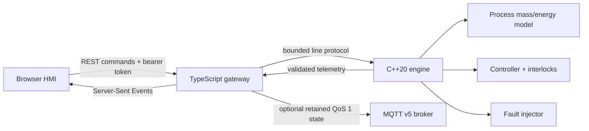

# Industrial Edge Digital Twin

A deterministic heated-tank simulator that makes timing, units, interlocks, signal quality, command
idempotency, and injected failures visible. The repository pairs a C++20 process and controller
engine with a strict-TypeScript edge gateway, an optional MQTT v5 publisher, and a responsive
browser HMI.

This is a synthetic educational system. It is not a safety controller, a certified process model, or
software for direct connection to physical equipment.

## Why this project exists

Normal dashboards often show only a number. This project treats an industrial signal as a bundle:
value, unit, source timestamp, quality, and applicability. It also distinguishes an actuator's
requested output from the output that actually occurred. That distinction makes stale sensors, stuck
actuators, interlocks, and safe-state behavior testable rather than implicit.

## Evidence at a glance

- Deterministic C++20 mass/energy model with a fixed 100 ms step.
- Stopped, manual, and automatic modes with centralized safety interlocks.
- Faults for frozen/out-of-range level sensing and stuck-on pump/heater behavior.
- Idempotent commands with bounded 256-entry engine history and a bounded gateway queue.
- Read-only REST and Server-Sent Events telemetry; bearer-protected write commands.
- Optional MQTT v5 retained state at QoS 1 with latest-value coalescing.
- Desktop and mobile HMI with keyboard, reflow, and automated WCAG A/AA checks.
- Linux sanitizer CI, Windows compiler CI, Node.js 22/24 CI, and pinned GitHub Actions.

Measured results live in [the validation report](docs/reports/validation-report.md), not in
unqualified claims.

## 60-second quick start

Prerequisites: CMake 3.25+, a C++20 compiler, Node.js 22 or 24, and pnpm 11.

### Linux or macOS

```bash
cmake -S . -B build -DCMAKE_BUILD_TYPE=Release
cmake --build build --parallel
ctest --test-dir build --output-on-failure
pnpm install --frozen-lockfile
pnpm build
TWIN_COMMAND_TOKEN=local-demo-token node gateway/dist/main.js
```

### Windows Developer PowerShell

```powershell
cmake -S . -B build -G Ninja -DCMAKE_BUILD_TYPE=Release
cmake --build build
ctest --test-dir build --output-on-failure
pnpm install --frozen-lockfile
pnpm build
$env:TWIN_COMMAND_TOKEN = "local-demo-token"
node gateway/dist/main.js
```

Open `http://127.0.0.1:8080`. Enter `local-demo-token` in **Command access**. The development token
is deliberately local-only; production mode refuses to start without an explicitly configured token.

## Demonstration path

1. Select **Automatic** and set a level and temperature target.
2. Compare requested and actual actuator outputs.
3. Inject **Freeze level sensor**. After 1.5 simulated seconds, quality changes to `stale`, the
   controller enters `faulted`, and requested outputs go to the documented safe state.
4. Clear faults, select **Stopped**, and inject **Pump stuck on**. Requested pump output remains 0%
   while actual output becomes 100%, making the physical override visible.
5. Inspect `/api/v1/health`, `/api/v1/state`, and the retained MQTT topic if a broker is enabled.

## Architecture



The gateway asks the engine to advance; wall-clock timing never enters the process equations. The
same command sequence therefore produces the same trace. See [architecture](docs/architecture.md),
[plant model](docs/plant-model.md), and [ADR 0001](docs/adr/0001-language-boundaries.md).

## Public interfaces

| Interface                 | Contract                     | Safety boundary                                  |
| ------------------------- | ---------------------------- | ------------------------------------------------ |
| `GET /api/v1/state`       | Latest validated snapshot    | Read-only                                        |
| `GET /api/v1/events`      | Server-Sent Events stream    | Read-only; maximum 32 clients                    |
| `GET /api/v1/health`      | Engine queue and MQTT status | No credentials or stderr returned                |
| `POST /api/v1/commands`   | Discriminated command union  | Bearer token, 16 KiB body, schema validation     |
| `edge-twin/tank-01/state` | Retained JSON snapshot       | Optional MQTT v5, QoS 1, latest-value coalescing |

The precise HTTP schema is in [OpenAPI](docs/openapi.yaml). Engine commands are documented in
[API and MQTT contracts](docs/api-and-mqtt.md).

## Commands

```bash
pnpm format:check       # formatting policy
pnpm lint               # type-aware linting
pnpm typecheck          # gateway, tests, HMI, and config files
pnpm test               # unit/integration tests with enforced coverage
pnpm test:e2e           # 12 desktop/mobile browser scenarios
pnpm build              # gateway JavaScript and static HMI
pnpm symbols:check      # exact line-location index is current
pnpm repository:check   # headers, links, pinning, structure, and naming policy
pnpm benchmark          # five 10,000-step throughput samples
```

The C++ equivalents are:

```bash
cmake -S . -B build -DCMAKE_BUILD_TYPE=Debug
cmake --build build --parallel
ctest --test-dir build --output-on-failure
./build/twin-engine --scenario sensor-freeze --steps 300
```

## Configuration

| Variable             | Default                               | Meaning                                            |
| -------------------- | ------------------------------------- | -------------------------------------------------- |
| `TWIN_COMMAND_TOKEN` | `local-demo-token` outside production | Bearer token; required in production               |
| `TWIN_ENGINE_PATH`   | Discovered under `build/`             | Explicit engine executable                         |
| `TWIN_HOST`          | `127.0.0.1`                           | Gateway listen address                             |
| `PORT`               | `8080`                                | Gateway port, range 1024–65535                     |
| `TWIN_TICK_MS`       | `100`                                 | Wall-clock tick request interval, range 20–5000 ms |
| `TWIN_STATIC_ROOT`   | `hmi/dist`                            | Built HMI directory                                |
| `MQTT_URL`           | unset                                 | Optional `mqtt://` or `mqtts://` broker URL        |

For a local demonstration broker, run `docker compose up broker`, then set
`MQTT_URL=mqtt://127.0.0.1:1883`. Anonymous access exists only inside this loopback-bound demo.

## Major features and where they live

| Feature                    | Main implementation               | Verification                                          |
| -------------------------- | --------------------------------- | ----------------------------------------------------- |
| Mass and energy balance    | `cpp/src/process_model.cpp`       | Physical-bound property loop and known-flow test      |
| Modes and interlocks       | `cpp/src/controller.cpp`          | Low/high level, stale quality, manual/automatic tests |
| Faults and idempotency     | `cpp/src/engine.cpp`              | Fault campaigns and duplicate-command tests           |
| Bounded process protocol   | `cpp/src/protocol.cpp`            | Oversize, control-character, escaping tests           |
| Runtime contracts          | `gateway/src/contracts.ts`        | Positive, negative, range, and extra-field tests      |
| Supervised process bridge  | `gateway/src/engine-client.ts`    | Real child-process integration and queue-bound tests  |
| HTTP/SSE security boundary | `gateway/src/server.ts`           | Auth, schema, health, static-host, and error tests    |
| MQTT coalescing            | `gateway/src/mqtt-publisher.ts`   | Success, replacement, failure, and shutdown tests     |
| Accessible HMI             | `hmi/src/app.ts` and `styles.css` | Playwright + axe on desktop and mobile Chromium       |

See the complete [file reference](docs/file-reference.md) and generated
[source symbol index](docs/generated/symbol-index.md).

## Documentation map

- [Architecture and data flow](docs/architecture.md)
- [Plant model, units, equations, and assumptions](docs/plant-model.md)
- [Fault catalog](docs/fault-catalog.md)
- [API and MQTT contracts](docs/api-and-mqtt.md)
- [Safety, security, and threat model](docs/safety-and-security.md)
- [Testing strategy](docs/testing.md)
- [Complexity analysis](docs/big-o.md)
- [Operations and rollback runbook](docs/operations.md)
- [Validation report](docs/reports/validation-report.md)
- [Design decisions](docs/adr/)

## Limitations

- The physics intentionally omits pressure, stratification, pump curves, boiling, and hardware
  timing. It is a software-design test fixture, not a high-fidelity process simulator.
- MQTT publishes current state; lifecycle semantics and broker ACL campaigns belong in a dedicated
  reliability lab.
- Automated accessibility checks cannot replace manual screen-reader and domain-user review.
- The local command token is suitable only for loopback demonstration. Use a real identity and
  authorization layer before any shared deployment.

## Maintenance evidence

See the [latest maintenance audit](docs/reports/maintenance-audit-2026-09-18.md) for hosted
verification and dependency compatibility decisions.

## License and contribution

The code is available under the [MIT License](LICENSE). Please read
[CONTRIBUTING.md](CONTRIBUTING.md) and [SECURITY.md](SECURITY.md) before opening a change.
