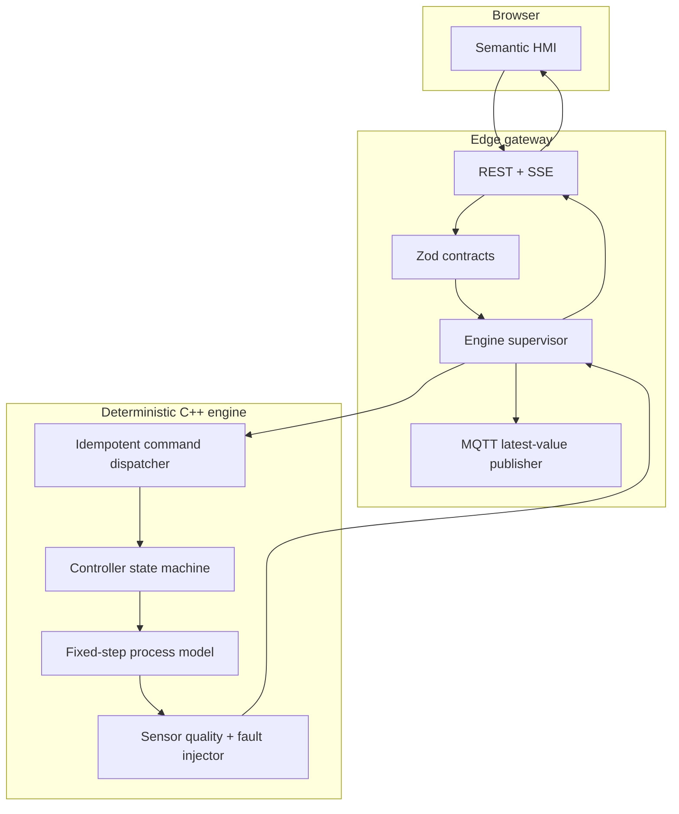
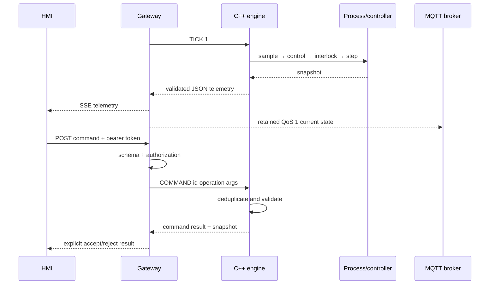

# Architecture and data flow

## Goals

The system demonstrates deterministic process behavior, explicit safety logic, bounded integration
work, and observable faults. Its primary quality attribute is explainability: every visible state
must trace to a model equation, controller rule, command, or injected fault.

## Components

### C++ engine

The C++20 layer owns physical state, fixed-step equations, sensing, controller modes, interlocks,
fault application, and command history. It does not own sockets, authentication, files, or wall
clock time. This keeps deterministic logic easy to test and allows sanitizer builds.

### TypeScript gateway

The gateway supervises one engine process, validates every JSON envelope, bounds pending commands at
64, requests at most one tick at a time, fans telemetry to at most 32 SSE clients, and optionally
coalesces MQTT publications to the newest state. A failed consumer cannot create an unbounded queue.

### Browser HMI

The HMI uses semantic HTML, external scripts/styles, text-only DOM updates, and responsive CSS. It
stores the command token only in memory. Read telemetry and write commands are visibly distinct.

## Tick and command sequence

## Failure containment

- Invalid engine JSON is not forwarded and is summarized in bounded diagnostics.
- A missing or exited engine makes health return 503 and commands fail closed.
- One tick may be in flight; late ticks increment a dropped counter instead of queueing.
- MQTT holds at most one pending snapshot and replaces it with newer state.
- SSE is capped at 32 clients; backpressured responses are closed.
- The C++ engine limits command input to 512 printable ASCII bytes and 16 tokens.
- Command results retain only the newest 256 identifiers.

## Trust boundaries

The browser, HTTP body, bearer token, engine stdout, and broker are separate trust boundaries. Zod
validates HTTP and engine objects. The C++ parser independently enforces line and token limits. The
browser renders all variable content with `textContent`, never HTML interpretation.

## Deployment boundary

The default listener is loopback. A shared deployment requires TLS termination, a real identity
provider, role-based authorization, secrets management, broker ACLs, structured audit storage, and
an engineering review of process-specific hazards. These are deliberately not implied by the demo.
